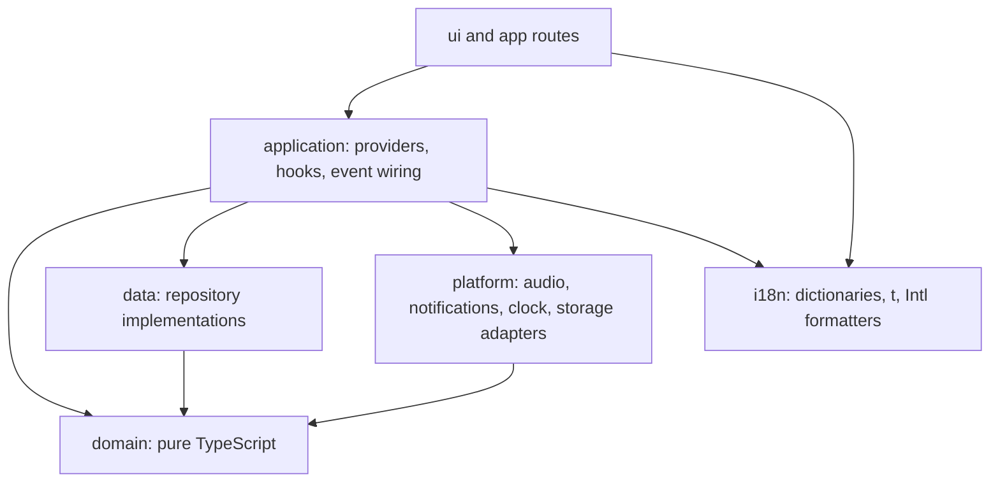

# Architecture

Status: Accepted. Implementation begins at Milestone 0 (see `MILESTONES.md`).

Source of truth for product behavior: `docs/PRD.md`. Technical choices: `docs/DECISIONS.md`.

## 1. Layers



Dependency rule: arrows are the only allowed import directions. `domain` imports nothing from any other layer.

## 2. Folder structure

```text
docs/
src/
  app/                      Next.js App Router: layouts, routes, metadata (Server Components by default)
    layout.tsx              <html lang dir>, font, providers
    page.tsx                Dashboard / Timer
    statistics/page.tsx
    settings/page.tsx
  ui/                       React components only; no business rules
    shell/                  sidebar, layout, toast host
    timer/                  visualizations (digital, analog), controls, reset dialog
    tasks/                  task panel, drawer
    stats/                  charts, heatmap, summary cards
    settings/
    audio/
    primitives/             Button, Dialog, Switch, etc. (small, hand-rolled, accessible)
  application/              Wiring; may use React
    providers/              Settings, Tasks, Goal, Locale, Theme providers
    timer/                  useTimer (useSyncExternalStore), timer event subscribers
    stats/                  hooks computing stats from sessions via domain
  domain/                   PURE TypeScript. No React, Next, DOM, Node, storage, Date.now
    timer/                  engine, types, events, clock port
    sessions/               PomodoroSession type, cycle/long-break rules
    tasks/                  Task type, rules: create, edit, delete, complete/reopen, selection
    goals/                  Goal type, progress
    stats/                  daily, weekly, long-term, streaks
    calendar/               local date, Gregorian/Jalali conversion, week/month boundaries
    settings/               UserSettings type, defaults, validation
    repositories/           Repository INTERFACES (ports) only
  data/                     Repository implementations
    local/                  localStorage-backed repos (shared data): settings, goal, tasks, sessions; schema envelope, migrations
    session/                sessionStorage-backed repos (per tab): timer state, selected task
    memory/                 in-memory repos (tests and storage-unavailable fallback)
  platform/                 Browser adapters behind interfaces
    clock.ts                systemClock: () => Date.now()
    audio/                  AudioProvider interface, HTMLAudio/WebAudio impl, sound assets registry
    notifications.ts
  i18n/                     Dictionaries (en.ts defines shape, fa.ts satisfies), t(), Intl formatters, locale/dir
public/                     Audio assets, icons, OG image
```

Notes:

- Repository interfaces live in `domain/repositories` so domain and stats logic can depend on them, and `data/` implements them. A future cloud repository is another folder under `data/`.
- `i18n` is pure TypeScript too, but it is not domain. It may use `Intl`. It has no React dependency except one thin hook in `application/`.
- `domain/calendar` is the only place that imports the Jalali library.

## 3. Enforcing the domain boundary

Three complementary mechanisms, none of which needs an extra dependency. All are run by `pnpm lint` and `pnpm typecheck`, and therefore by the definition of done.

1. **Separate TypeScript project without DOM types.** `tsconfig.domain.json` includes only `src/domain/**` and `src/i18n/**`, with `"lib": ["ES2023"]` (no `DOM`), `"types": []` (no `@types/node`, no React types), and `paths` limited to `domain`. Any reference to `window`, `document`, `localStorage`, `sessionStorage`, `setTimeout`, `process`, or a React import fails to compile. `pnpm typecheck` runs `tsc -p tsconfig.json --noEmit && tsc -p tsconfig.domain.json --noEmit`.
   - `Intl` is in the ES lib, so domain code can format dates and numbers. `setTimeout` is not, and the engine does not need it (see section 4).
   - `Date` exists in ES. See rule 3 for how it is constrained.
2. **ESLint `no-restricted-imports` for `src/domain/**`** (flat config override, built-in rule only). Forbidden patterns: `react`, `react-dom`, `next`, `next/*`, `@/ui/*`, `@/application/*`, `@/data/*`, `@/platform/*`, `@/app/*`, and `jalaali-js` everywhere except `src/domain/calendar/**`. A second override for `src/ui/**` forbids `@/data/*` and `@/platform/*`, so UI never touches storage directly (PRD section 19). A third for `src/app`, `src/ui`, and `src/application` forbids direct `localStorage`, `sessionStorage` and `window.*Storage` use via `no-restricted-globals` / `no-restricted-properties` (only `src/data/local` and `src/data/session` may use `localStorage` and `sessionStorage`).
3. **ESLint `no-restricted-syntax` and `no-restricted-properties` in `src/domain/**` for hidden time and randomness**: forbid `Date.now`, `new Date()` with no arguments, `performance.now`, and `Math.random`. Time enters only through the injected `Clock`, and IDs through an injected `IdGenerator`. `new Date(timestamp)` with an argument is allowed for pure conversions.

Additional convention checks, using the same built-in rule:

- No physical Tailwind direction classes (`ml-`, `mr-`, `pl-`, `pr-`, `left-`, `right-`, `text-left`, `text-right`, `rounded-l`, `rounded-r`, `border-l`, `border-r`) in `src/ui/**` string literals. Use `ms-`, `me-`, `ps-`, `pe-`, `start-`, `end-`, `text-start`, `text-end`, and so on. Exceptions need an eslint-disable comment with a reason.
- No JSX text literals that contain letters in `src/ui/**` (`react/jsx-no-literals` is not available without a plugin, so use a `no-restricted-syntax` selector on `JSXText` matching `\S`), which enforces "no hardcoded user-facing strings".

If a rule turns out too noisy, downgrade it to a documented test (a Vitest test that greps the tree). Do not add `eslint-plugin-boundaries` unless the built-in approach fails.

## 4. Timer engine

Location: `src/domain/timer/`. Pure TypeScript, deterministic, independent of React, visualization, persistence, audio, and statistics (AGENTS rule 4).

### 4.1 Types

```ts
type SessionType = 'work' | 'shortBreak' | 'longBreak';

type TimerStatus = 'idle' | 'running' | 'paused';

interface TimerConfig {
  workMs: number;
  shortBreakMs: number;
  longBreakMs: number;
  sessionsBeforeLongBreak: number; // default 4
  autoStartNext: boolean;
}

interface Clock {
  now(): number; // epoch milliseconds
}

interface TimerSnapshot {          // immutable; new object per change
  status: TimerStatus;
  sessionType: SessionType;        // the current (or upcoming, when idle) session
  plannedMs: number;
  remainingMs: number;             // computed from the clock at snapshot time
  completedWorkInCycle: number;    // 0..sessionsBeforeLongBreak-1
  version: number;                 // increments on every state change (not on every tick)
}

// Serializable subset the application layer may persist and later hand back to restore().
// The cycle counter is deliberately NOT part of it (PRD section 5: derived from today's sessions).
interface TimerState {
  status: TimerStatus;
  sessionType: SessionType;
  plannedMs: number;
  endsAt: number | null;           // epoch ms; set when running
  remainingMs: number | null;      // set when paused
}

// What the application layer writes to storage: engine state plus the time of the write.
// On restore a running timer becomes paused with remaining = clamp(endsAt - savedAt, 0, plannedMs),
// so time spent closed never counts (PRD section 5). The computation is a pure function in
// domain/timer and does not read the clock.
interface PersistedTimerState extends TimerState {
  savedAt: number;                 // epoch ms of the last write
}

type TimerEvent =
  | { type: 'started';   sessionType: SessionType; at: number }
  | { type: 'paused';    at: number }
  | { type: 'resumed';   at: number }
  | { type: 'reset';     sessionType: SessionType; at: number }
  | { type: 'skipped';   sessionType: SessionType; at: number }
  | { type: 'completed'; sessionType: SessionType; plannedMs: number; completedAt: number;
      restored: boolean }          // true only for the zero-remaining edge case on restore (4.4)
  | { type: 'transitioned'; from: SessionType; to: SessionType; autoStarted: boolean };

interface TimerEngine {
  getSnapshot(): TimerSnapshot;          // recomputes remainingMs from clock
  subscribe(listener: () => void): () => void;   // state changes (for useSyncExternalStore)
  onEvent(listener: (e: TimerEvent) => void): () => void; // domain events
  start(): void;                         // idle -> running
  pause(): void;                         // running -> paused
  resume(): void;                        // paused -> running
  reset(): void;                         // running|paused -> idle, same session type, not counted
  skip(): void;                          // advance to next session type, not counted
  tick(): void;                          // evaluates the clock; completes the session if due
  updateConfig(config: TimerConfig): void; // applies to the NEXT session
  getState(): TimerState;                // serializable; the application layer adds savedAt and persists (per tab)
  setCompletedWorkInCycle(n: number): void; // only while idle; see 4.6
}

function createTimerEngine(deps: {
  clock: Clock;
  config: TimerConfig;
  restore?: PersistedTimerState;         // optional state persisted by a previous page load
  completedWorkInCycle?: number;         // derived by the caller from today's sessions; default 0
}): TimerEngine;

// domain/sessions
function cycleProgress(todaysWorkSessionCount: number, sessionsBeforeLongBreak: number): number;
// = count mod sessionsBeforeLongBreak
```

The engine has no `setInterval` and no `setTimeout`. It never schedules itself. A driver in `application/timer` calls `tick()` and the engine decides what has happened from timestamps alone. This makes every behavior testable with a fake clock and no fake timers.

### 4.2 Timestamp model

- While running the engine stores `endsAt` (epoch ms). `remainingMs = max(0, endsAt - clock.now())`. Nothing is ever decremented.
- On `pause`, store `remainingMs = endsAt - now` and clear `endsAt`. On `resume`, set `endsAt = now + remainingMs`. Pause may last indefinitely.
- `start` sets `endsAt = now + plannedMs`.
- `tick()` (and `getSnapshot()`) with `now >= endsAt` triggers completion exactly once.
- Clock goes backwards (manual system-clock change): `remainingMs` is clamped to `plannedMs` at most. The engine does not crash. This is an accepted edge case; document it in the test suite.

### 4.3 Injected clock

- The engine receives a `Clock`. Production uses `systemClock = { now: () => Date.now() }` in `platform/clock.ts`. Tests use a `FakeClock` with `advance(ms)` and `set(ts)`.
- `Date.now()` is used, not `performance.now()`. Wall-clock time keeps advancing across computer sleep in all major browsers, while the monotonic clock may pause during sleep. The user expects a 25 minute session to end 25 minutes later in real time.
- The engine never touches the clock from within pure helper functions; only `start`, `resume`, `pause`, `tick`, and `getSnapshot` read it.

### 4.4 Persistence and recovery after reload

The PRD (section 5) requires the timer state to survive reload of a tab (and reopen-closed-tab and session restore), to come back **paused**, and to be **independent per tab**. The engine stays persistence-agnostic: it exposes `getState()` and accepts a `restore` state. The application layer does the saving, through a `TimerStateRepository`.

Where it lives: `sessionStorage` (key `pomodoro.timer`), implemented in `src/data/session`. `sessionStorage` is per tab by definition. It survives reload and the browser's reopen-closed-tab and session-restore features, it is not visible to other tabs, and the browser cleans it up when the tab is gone, so there is no tab ID and no stale-key cleanup to build. A brand-new tab has empty session storage and therefore starts with a fresh idle timer. The selected task ID is stored the same way (key `pomodoro.selectedTask`).

Saving (application layer, `PersistedTimerState = getState() + savedAt: clock.now()`):

- On every engine state change (`snapshot.version` changes: start, pause, resume, reset, skip, completion, transition).
- On `pagehide` and on `visibilitychange` to hidden. Without this, a running timer closed by reload would restore at its last state change and lose all elapsed time. It is a close/hide event handler, not a periodic save. Writing is synchronous and cheap.
- Never on every tick, and no periodic or heartbeat writes.
- Known limit: if the tab dies with no close event (browser crash, killed by the OS while hidden and `visibilitychange` did not fire), the timer restores as of the last state change. This is accepted (PRD section 5).

Boot sequence (application layer):

1. Load today's completed work sessions from `SessionRepository` (shared data) and compute `completedWorkInCycle = cycleProgress(count, sessionsBeforeLongBreak)`.
2. Load this tab's persisted state (corrupt, unknown, or missing state means fresh `idle` `work`).
3. Create the engine with `{ restore, completedWorkInCycle }`. Restore rules are pure and independent of the current time:
   - `idle`: stay idle on the stored session type.
   - `paused`: stay paused with the stored `remainingMs`.
   - `running`: become `paused` with `remainingMs = clamp(endsAt - savedAt, 0, plannedMs)`.
   - Edge case, resulting `remainingMs === 0` (the session ended at the moment the tab closed): complete exactly once during construction, emit `completed` with `restored: true` and `completedAt = endsAt`, and move to the next session `idle`, never auto-started, even if `autoStartNext` is on.
4. The event subscriber (4.7) records that edge-case completion like any other, but skips sound and notification when `restored` is true. It may show the toast.
5. The UI shows the restored timer as clearly paused, and the user presses Resume. No automatic resume.

Consequences and limits:

- Time spent closed never counts. A 25 minute session closed with 15 minutes left reopens with 15 minutes left.
- Restore does not depend on `clock.now()`, so it is deterministic and trivial to test with plain data.
- Independent tabs: every tab has its own engine and its own session storage. There is no timer sync, no `storage` event handling for timer state, and no leader election. Duplicating a tab (browser "Duplicate") copies session storage once; from then on the two are independent.
- Shared data (tasks, settings, goal, completed sessions) lives in `localStorage`, so several tabs write to it. Repository writes are therefore operation-level read-modify-write against the current stored value (for example `add(session)` reads the month's array at write time, appends, and writes it back in one synchronous block), never "write my cached copy". This prevents one tab erasing another tab's sessions or tasks. Other tabs may show stale task lists or statistics until they reload; live sync is out of V1.
- The derived cycle counter reads shared sessions, so it counts work sessions completed in any tab today. It follows the data, so changing `sessionsBeforeLongBreak` or completing a session near midnight cannot make it stale. Because it is re-derived before each work session starts (4.6), two tabs cannot make it drift.

### 4.5 Behavior when the tab is backgrounded

The engine's correctness does not depend on tick frequency. Only how promptly events fire depends on the driver.

Driver (`application/timer/useTimerDriver`, uses browser APIs):

- While `status === 'running'`: a `setInterval` of about 250 ms calls `engine.tick()`. This is a repaint cadence, not a counter.
- Also schedule a one-shot `setTimeout(engine.tick, remainingMs)` aimed at `endsAt`, to wake as close to completion as the browser allows.
- Call `engine.tick()` immediately on `visibilitychange` (visible), `focus`, and `pageshow`, so the display is exact the moment the user returns.
- Stop the interval when idle or paused.

Consequences (documented and tested at the engine level):

- Displayed remaining time is always exact, because it is recomputed from `endsAt`.
- Throttled timers (Chrome throttles background timers to 1 Hz, and after about 5 minutes hidden, to about once per minute) can delay the `completed` event, and therefore the sound and notification, by up to about a minute. This is the known limit of a main-thread driver. If unacceptable, a Web Worker timer can be swapped into the driver without touching the engine.
- After computer sleep or a long stall, the next `tick()` finds `now >= endsAt` and completes exactly one session. `completedAt` is the planned `endsAt`, not the time the tick ran. This keeps the record and the local date correct, including near midnight.
- Multiple sessions never complete from a single tick. If auto-start is on, the next session starts at the tick's `now` (not back-dated), so a long sleep does not trigger a cascade of sessions.

### 4.6 Session transitions

- On work completion: increment `completedWorkInCycle`. If it reaches `sessionsBeforeLongBreak`, the next session is `longBreak` and the counter resets to 0 when that long break ends (or is skipped). Otherwise `shortBreak`. This matches the derived value `count mod n`, so both agree.
- The application layer calls `setCompletedWorkInCycle(cycleProgress(todayCount, n))` while the engine is idle, before each work session starts. That keeps the in-memory counter equal to today's data even after midnight rollover, settings changes, or a deleted-data edge case. The engine never reads sessions itself.
- After a break (completed or skipped) the next session is `work`.
- Skipping a work session does not increment the counter, and does not emit a `completed` event. Skipping a break has no statistics impact (PRD section 5).
- Emitting `completed` with `sessionType === 'work'` is the only trigger for recording a Pomodoro.
- After every completion or skip the engine moves to the next session in `idle`, or `running` if `autoStartNext` is true. `transitioned` reports which.
- `reset` returns the current session to `idle` at full planned duration. It requires user confirmation, which is enforced in the UI (the engine has no dialogs), and it does not count.
- Config changes apply to the next session; they never alter a running session's `endsAt`.

### 4.7 Event consumers (application layer)

A single subscriber module in `application/timer` reacts to engine events:

- `completed` (work): build a `PomodoroSession` (`id` from the injected `IdGenerator`, `localDate` from `domain/calendar` with the user's timezone, `taskId` from the currently selected task, or none if the task no longer exists), save via `SessionRepository`, then, unless `restored` is true, trigger sound and notification, and show the toast (each behind its own adapter, each failure-tolerant).
- The selected task ID is per tab, stored in session storage next to the timer state (not with the shared tasks), so after a reload of that tab the same task is still selected, and other tabs are unaffected. If the selected task was deleted in any tab, the completion has no task.
- Others: analytics hooks are out of V1.

## 5. Other domain modules

- `domain/calendar`: `localDateOf(timestamp, timeZone) -> 'YYYY-MM-DD'`, Gregorian/Jalali conversion, month and week boundaries with a `weekStart` parameter.
- `domain/stats`: pure functions over `PomodoroSession[]`. Includes `dailySummary`, `weeklySummary`, `longTermSummary`, `currentStreak`, `longestStreak`, and `goalProgress`. No repositories, no React.
- Streak rule (required by PRD section 9): a local date counts as active if it has at least one completed work Pomodoro. The current streak is the number of consecutive active dates ending today, or ending yesterday if today has none yet (the streak is not broken until the day ends). Grouping uses the stored `localDate`, computed at completion time with the user's timezone, never UTC. The daily goal does not affect streaks.
- `domain/settings`: `UserSettings`, defaults (fa, Jalali, Persian numerals, blue accent, and so on), validation and normalization used by the repository on read.

## 6. Localization and RTL

- `<html lang dir>` is set on the server from a locale cookie (default `fa`, `dir=rtl`).
- All strings come from `i18n` dictionaries. Numbers, durations, and dates are formatted only through `i18n` and `domain/calendar` helpers. Raw `toLocaleString` and `toFixed` in UI code are prohibited by convention.
- Numerals, calendar, and language are three independent settings.
- Directional icons (arrows, task-panel handle) use logical positioning or flip via `rtl:` variants. Reviewed per component.

## 7. Rendering model

- Server Components: `app/layout.tsx`, route shells, `generateMetadata`. Everything that touches settings, tasks, timer, audio, or stats is a Client Component under a client provider tree.
- Avoid theme and locale flashes: locale and theme are also mirrored into cookies so the server can render the right `lang`, `dir`, and theme class on first paint.

## 8. Testing strategy

- Vitest, `node` environment for `domain`, `data`, `i18n`. `jsdom` only where a component test is worth it.
- Timer: fake clock tests for start, pause, resume, reset, skip, completion, auto transition, long-break count, background gap (advance clock by hours then `tick()`), sleep gap, clock going backwards, and config changes mid-session. Restore: idle, paused, running (restored as paused with `remaining = endsAt - savedAt`, clamped), zero remaining (completes once, `restored: true`, `completedAt = endsAt`, no auto-start), corrupt state, two engines with separate stores not affecting each other, and `cycleProgress` including a changed `sessionsBeforeLongBreak`.
- Stats and calendar: explicit `timeZone` in tests, including DST boundaries, session just before and after local midnight, Jalali month and year boundaries (Esfand to Farvardin, leap years), and week starts.
- Persistence: migration fixtures, corrupt JSON, quota errors, and unavailable storage.
- i18n: key parity between `en` and `fa`, numeral formatting in both systems, and `dir` selection.
